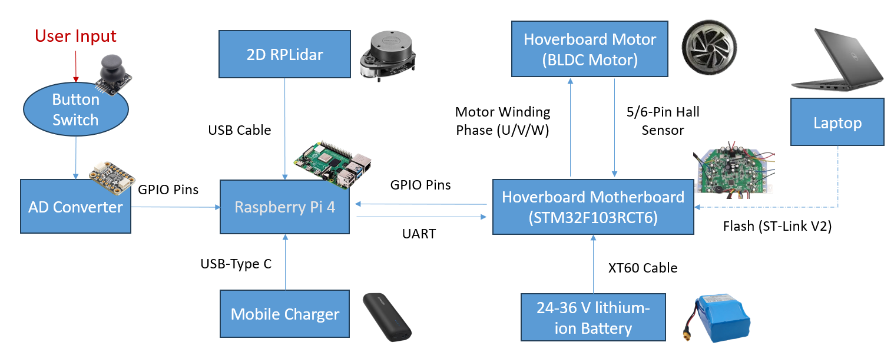
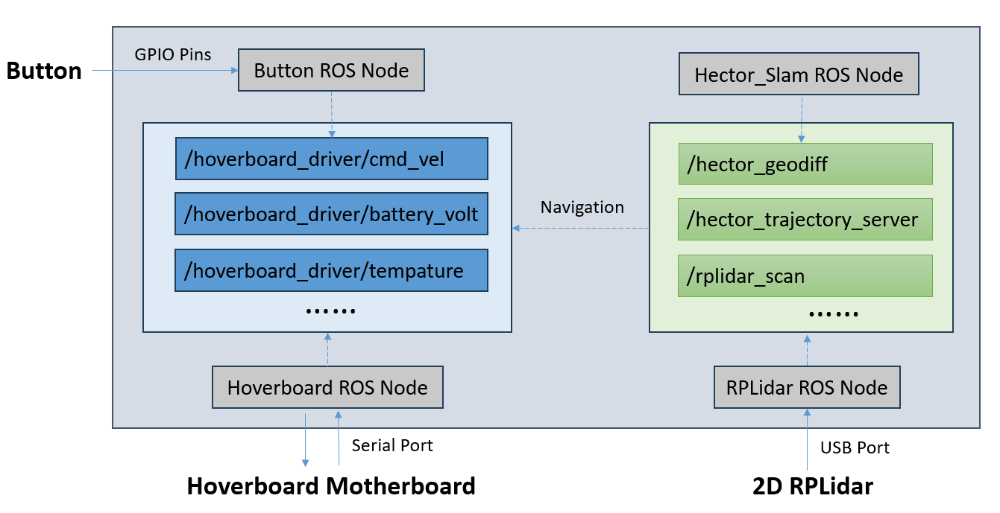

# Hover-Cartpole (A cheap and practical platform designed for assisting the blind)

---

This repo contains the codebase for an affordable, self-assembled wheeled robot designed to aid individuals with visual
impairments while performing navigation tasks. The overall modules include:

## Hardware Architecture

---

The hardware architecture is depicted as below. The modules include:

* A dual-layer mobile robot chassis
* A hacked board with two BLDC motors for propulsion
* A 2D RPLidar for user's navigation assistance
* A guidance cane equipped with a button switch
* A Raspberry Pi serving as the master controller

## Software Architecture

---

